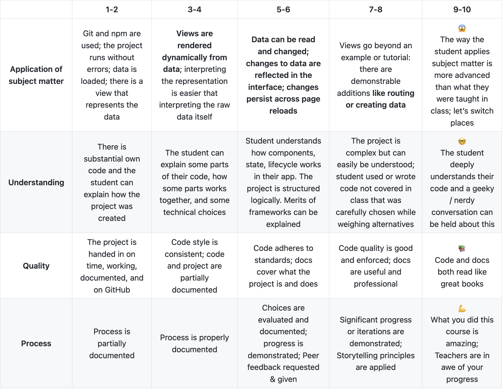

# Repo naam

Welkom bij mijn project van Frontend Applications.
BESCHRIJVING

De website is [hier](#LINK HIER) te zien.

### Installatie ⚙️

Om de app lokaal te laten draaien moet het project eerst lokaal worden gecloned.
Als dit stukje code gerunt wordt in de terminal wordt de repository lokaal gecloned:

`gh repo clone tomvandenberg11/frontend-applications.git`

Ga eerst naar de folder waarin je wilt dat het project gecloned wordt. Je kan in de terminal navigeren met `cd` met daar achter de map waar je heen wilt.

Daarna is het nodig om `node` en `npm` geinstalleerd te hebben op je lokale computer. Als je deze stappen gevolgd hebt, worden met `npm install` de benodigde packages gedownload.

### Running 🏃🏻

Als je de bovenstaande stappen gevolgd hebt kan de app opgestart worden door:

`npm run server`

te runnen in de terminal.
Je ziet dan een bericht in de terminal staan op welke link de app te zien is.

## Rubrics 🅰️

## Licence 👨🏻‍⚖️

Dit project is voorzien van een MIT licence. Zie de pagina LICENCE voor meer informatie.

## Credits 📣

Ik wil graag als eerste de docenten bedanken voor al hun inzet, uitleg en lesstof. Ten tweede wil ik mijn supportgroepje bedanken voor de mentale en functionele support. Ten derde wil ik Stackoverflow bedanken voor al hun antwoorden op mijn vragen.
